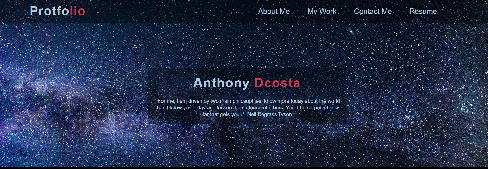
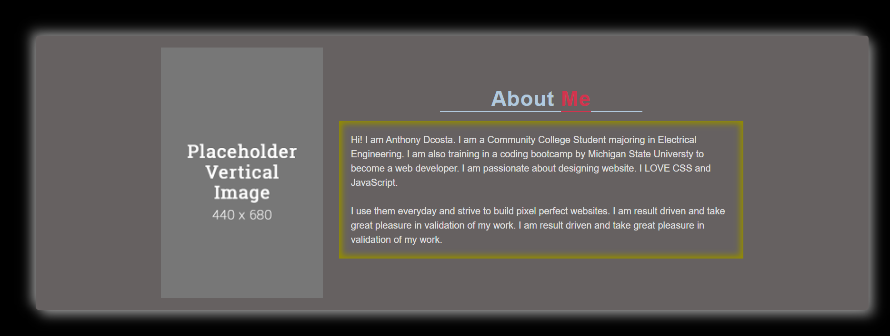
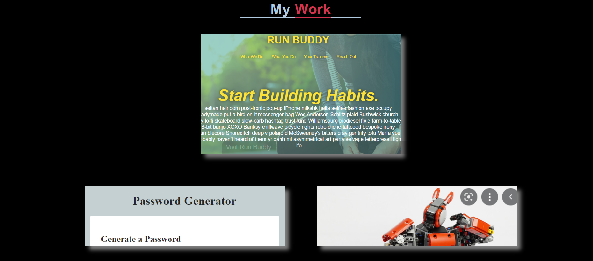

# Profession Protfolio
Click [here](https://ancosta993.github.io/professional-protfolio/) for the project.

## Introduction
A protfolio in progression for myself (Anthony Dcosta). It gathers all the projects in one place and showcases them thorugh CSS styling. Besides that, it also provides information about myself. Only HTML and CSS are being used in this project at the moment. Javascript will be used later on for new features.

## Website Structure
- The website is structed with ` <header>  <main> <footer>`. The `<main>` is further devided into `<section>`.
- These `<section>`s are given class attribute for hero, about-me, my-work, contact-me.
### Header 
- Header contains the primary navigation bar, which is structured implemented by nesting `<nav> <ul> <li> <a>`. `nav` is used for semantic HTML. The actual styles of CSS was applied to `ul`, `li`, `a` elements.

- Flexbox is used for expanding the links and the logo horizontally. Then CSS prpoerties and psuedo class `:hover` was used to add styling to indivual links for scaling and background.

### Hero
Serves as an indtroduction for the protfolio website with a background image, name, and a quote. The background image was `fixed` attached with the header for smooth transition to the hero section. The name and the quote was centered.

### About me
Used dark overall brackground. `<article>` tag was used to display my information: my image and my-text. Flexbox is used for the image and my-text to center them horizontally. `<box-shadow>` is used for the `<article>` for a 3D feeling. Furthermore, `<box-shadow>` is used with `inset` value for the text for an emphasize. 

### My Work 
- Shows all the finished or in progression projects. The links to the projects are provided with the images that represent the projects. 
- The images for the project were embedded in the document through CSS `background` property. Sizing images within the CSS `backround` property is much easier than sizing and positioning an `img` element. 
- The first finished project (Run Buddy) is made larger than the rest of the projects.
- Flexbox is used to position the projects hirzontally.
- CSS `:hover` pseudo class is used to add `transition` and `box-shadow`.

### Contact me
Contact me section contains the links to social media and a title, for now. The links are also styled to scale with `:hover` pseudo calss. Flexbox was used to center the links and the header. 

## Feature

### Responsive Website
- In here, responsive is meant that the website page is rendered appropriately for any screen sizes of the device. Basically, the site changes size and style accordingly in response to the change in size of the browser window.
- `@media` queries have been used to establish this for screens of sizes`max-width(980px)` for smaller desktop monitors, `max-width(768px)` for tablets and ipads, `max-width(575px)` for smart phones, `max-width(450px)` for the smallest screen sizes (Iphone SE etc).
- for smaller screen sizes, the website uses more vertical space than horizontal. For example, in CSS `flex-direction: column` is used through mediaqueries. 

### Interactive
- Most of the elements interacts with the user:
    - the `<a>` tages in the `<header>` tag scales and changes background color when the user hovers over them.
    - the `<a>` tags in the `<contact>` tag scales and changes background color when the user hovers over them.
    - clicks in the links at the header section smoothly scrolls the user to the appropriate section of the page. 
    - the `
` tags containing `class = img` in the My work section adds box shadows over the image to darken it and shows the link to the projects.
    
## Improvement Needed
- Add media queries for smaller screen.
- image for about me section will be replaced with my actual image.
- use javascript for more interactivity.

## Finished Project

